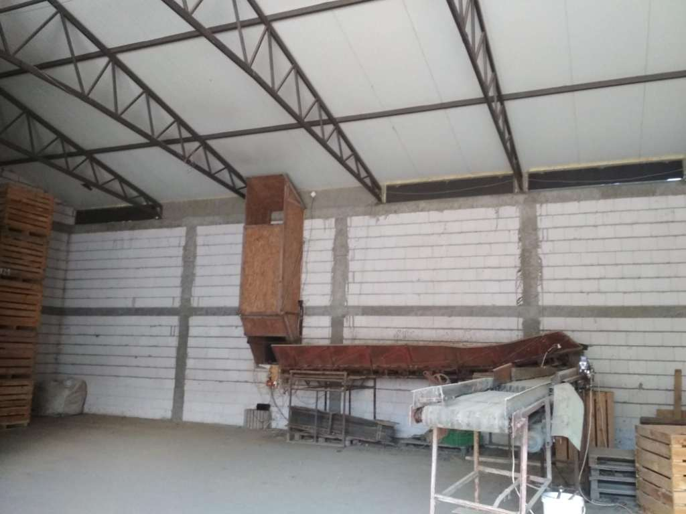
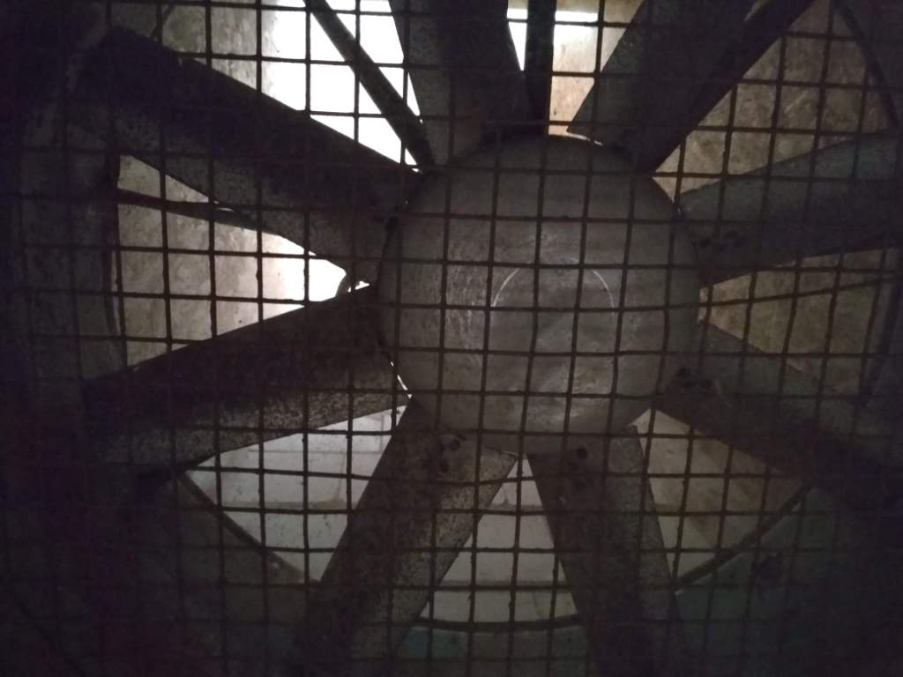
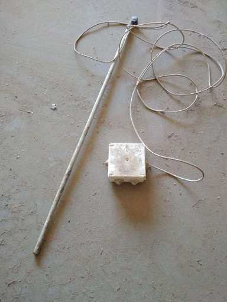
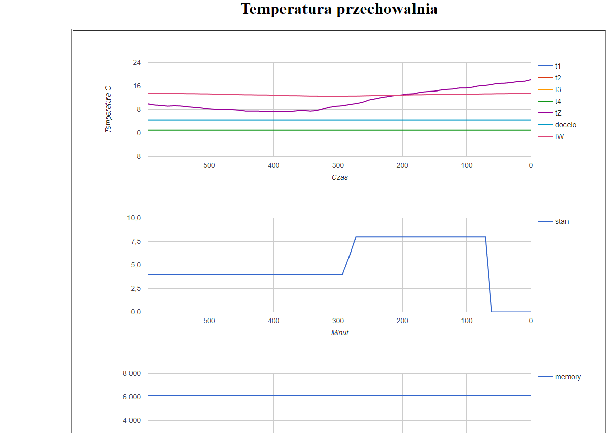
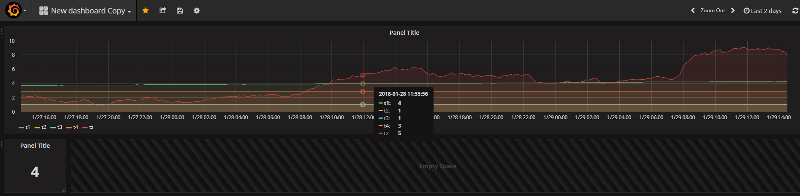

# przechowalnia
Sterowanie temperaturą w przechowalni warzyw oraz jej wizualizacja
##
Celem działania jest użycie powietrza zewnętrznego do schłodzenia przechowywanych warzyw. 
###
Poniżej widok przechowalni; pod okapem dachu poziome klapy poruszne elektrycznymi siłownikami liniowymi pełniące rolę wyrzutni ciepłego powietrza; na ścianie pionowy kanał rozpoczynjący się czerpnią zimnego powietrza zewnętrznego, wewnątrz kanału wentylator wyrzucający chłodne powietrze.

Układ sterujący okresowo przyjmuje wiadomości od bezprzewodowych czujników zawierające zmierzoną temperaturę oraz napięcie baterii zasilających. Zakładając, że  wiadomości są wysyłane co 10 minut, baterie pozwalają na 2 lata pracy czujnika. Poniżej układ czujnika z sondą temperatury.

Układ sterujący na podstawie danych steruje stanem przepustnic wentylacyjnych oraz wentylatorów, a także przesyła zebrane wartości poprzez formularz php do bazy sql. Wizualizacja  możliwa poprzez google charts lub serwis Grafana.

